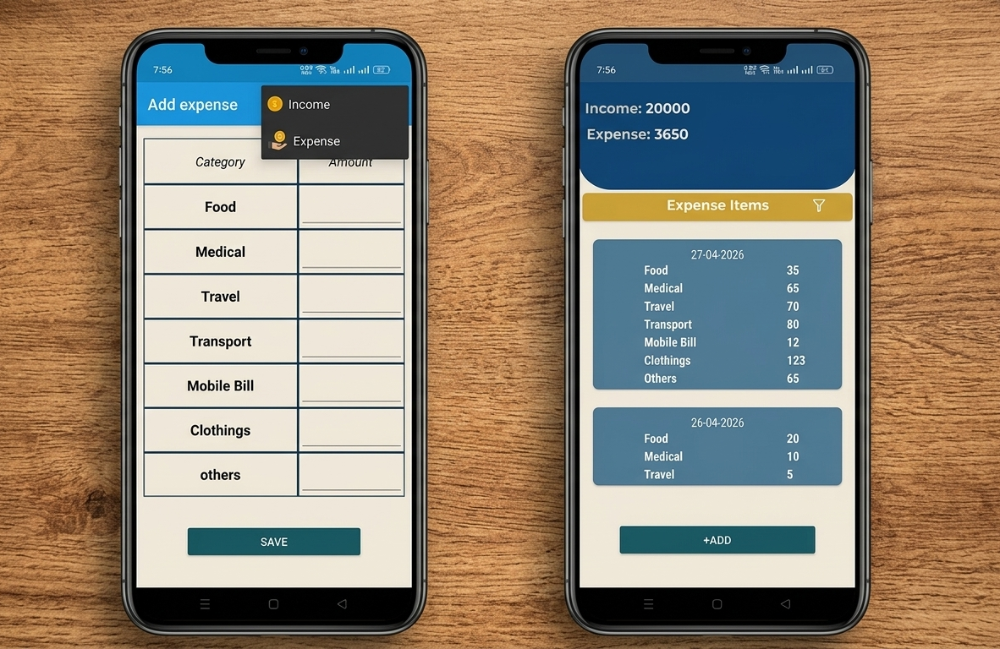

#Introduction

# A simple and efficient expense tracking app that enables users to manage their daily and monthly spending

See below for more information.

# Technologies & Architecture

Technologies
Android, Kotlin

Architecture
Model-View-ViewModel (MVVM)

# Firebase
Firebase Firestore

# Architecture Components

https://developer.android.com/reference/androidx/leanback/app/BaseFragment

Efficiently track and manage all user expenses.
Send notifications when the user's monthly income limit is reached.
Sort expenses in descending order (highest to lowest) for better analysis.
Provide access to previous expense history.
Automatically assign dates to each expense entry.
Display the remaining balance calculated from total income and expenses.
 
- # Tech Stack
- Kotlin
- XML (UI Design)
- Firebase
- MVVM Architecture

- # Screenshots

  # Installation
1. Clone this repository  
2. Open in Android Studio  
3. Add your API key in Constants file  
4. Run the projec

 # Contact  
Email: mdrayhan8045@gmail.com
https://github.com/rayhan0182/Expense-tracker
