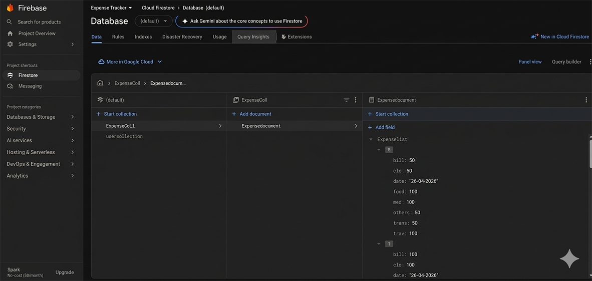

# Introduction  
# A simple and efficient expense tracking app that enables users to manage their daily and monthly spending

See below for more information.

# Technologies & Architecture

# Technologies
Android, Kotlin

# Architecture
Model-View-ViewModel (MVVM)

# Firebase
Firebase Firestore

# Architecture Components

[ViewModel Docs](https://developer.android.com/topic/libraries/architecture/viewmodel)

[LiveData Docs](https://developer.android.com/topic/libraries/architecture/livedata)

[Data Binding Docs](https://developer.android.com/topic/libraries/data-binding)

[Navigation Docs](https://developer.android.com/guide/navigation/)

[BaseFragment Docs](https://developer.android.com/reference/androidx/leanback/app/BaseFragment)

# Features

Efficiently track and manage all user expenses.
Send notifications when the user's monthly income limit is reached.
Sort expenses in descending order (highest to lowest) for better analysis.
Provide access to previous expense history.
Automatically assign dates to each expense entry.
Display the remaining balance calculated from total income and expenses.
 
# Firestore

- # Screenshots

# Setup
# Requirements

Basic knowledge about Android Studio
Basic knowledge about Firebase

 # Project

1. Download and open the project in Android Studio
2. Connect your Android phone or use the emulator to start the application

 # Contact  
Email: mdrayhan8045@gmail.com
https://github.com/rayhan0182/Expense-tracker
